# Evidencia · asistente integrado (identidad + responsive + plan de escaneo) — FIXTURE

**Datos simulados.** Estas capturas salen de la rama **de previsualización** `claude/onb-responsive-preview-2` (nunca se fusiona): contiene esta rama (#553, con la alternativa responsive ya integrada) **más el head de #550** (`4264b927`, SCAN-PLAN-UNITS-1) y unas rutas de fixture con respuestas fijas.
No llama a Gemini, Supabase ni Stripe; «Crear dominio» no hace nada. Chromium sobre Linux, sin dispositivo real. Una imagen no es una prueba de interacción.

## Qué muestra

- Paso 3 con **72 respuestas esperadas · 8 prompts × 3 pasadas × 3 motores** (plan Pro, muestreo activo): la cuenta de #550 sigue intacta con el asistente de identidad y el responsive. `scanContext` se conserva tal cual.
- Los tres pasos a 390, 768 y 1280 px y el caso de texto largo (paso 2) a 390 y 768.

## Medidas (mismo fixture, 390 / 768 / 1280)

- 0 elementos fuera del viewport y `scrollWidth` = ancho en las 18 combinaciones (normal y largo, 3 pasos).
- Tab hasta «Continuar a prompts» (paso 2) y «Crear dominio y escanear» (paso 3): alcanzado en las 6 pruebas (normal y largo × 3 anchos).
- Editor de prompt: 320 px de ancho a 390, 188 px a 768, 592 px a 1280; «Listo, prompt 1» + Enter lo cierra.
- A 768 px el texto del prompt sigue en una línea con puntos suspensivos (editor con engranaje). A 390 el caso largo recorta «Estados Unidos» en la barra de dominio (78/95 px, con puntos suspensivos).
- Caso largo: 45 respuestas esperadas · 3 prompts × 5 pasadas × 3 motores (el suelo de 50 sube las pasadas con pocos prompts: es la cuenta de #550).

## No verificado

Dispositivo real, otros navegadores, lector de pantalla, la creación real de un dominio y un escaneo, el piloto y el preview real con backend.

## 390 px

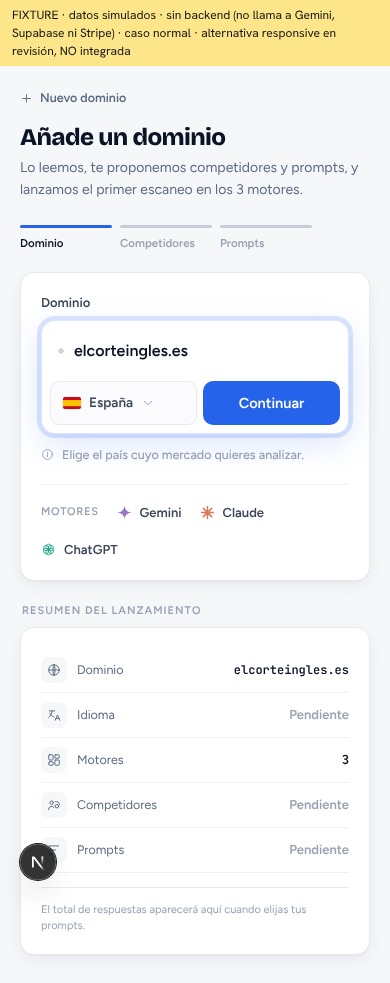

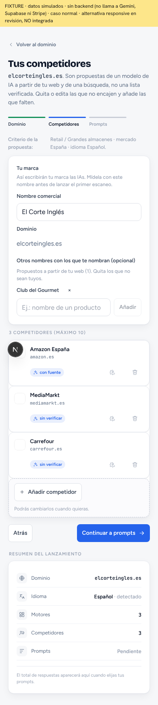

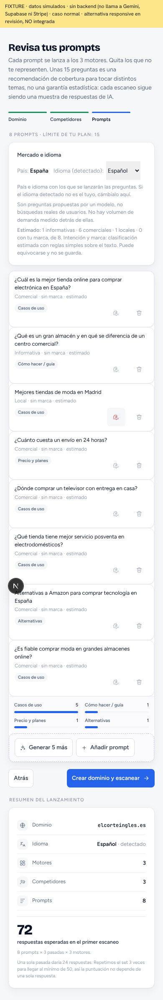

## 768 px

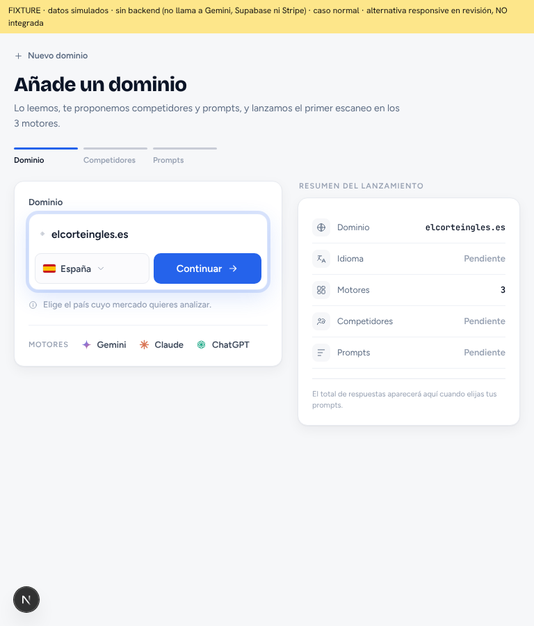

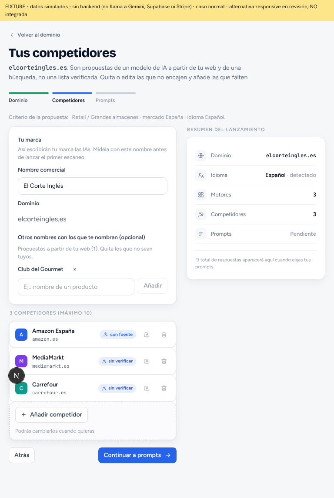

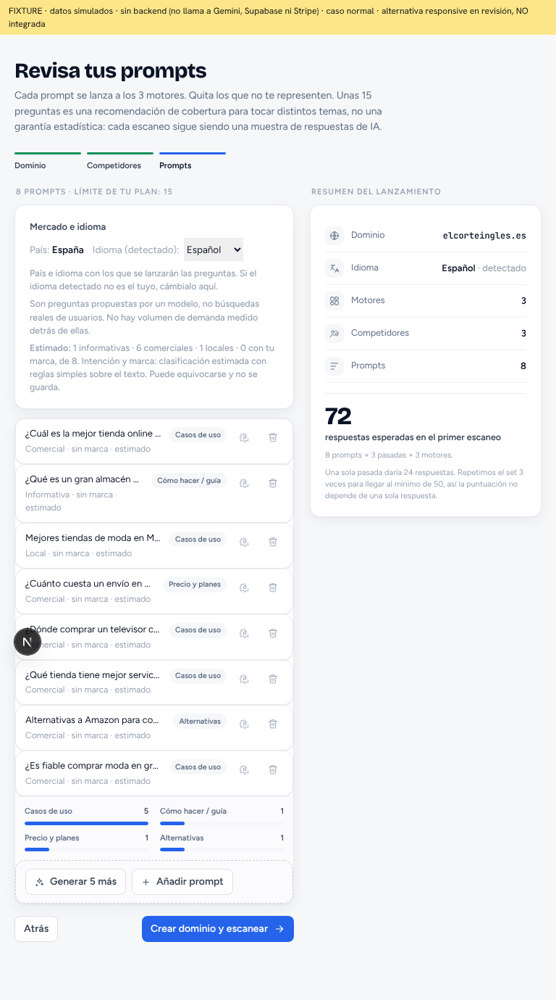

## 1280 px

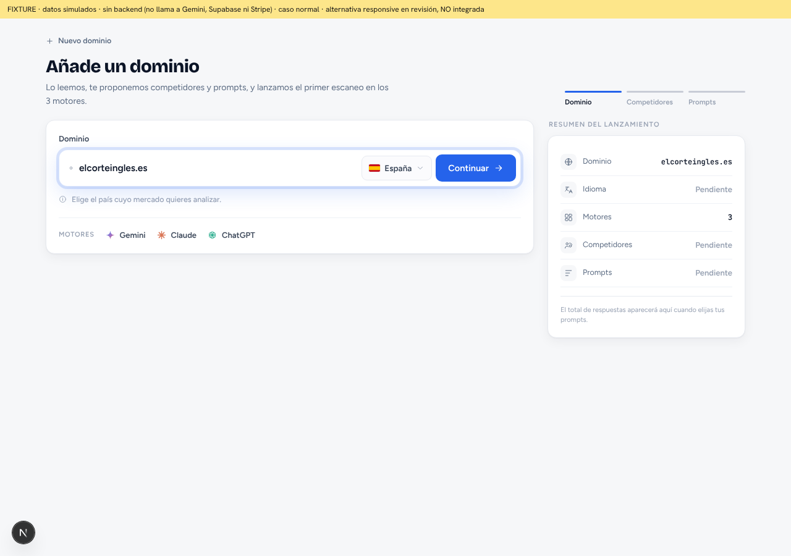

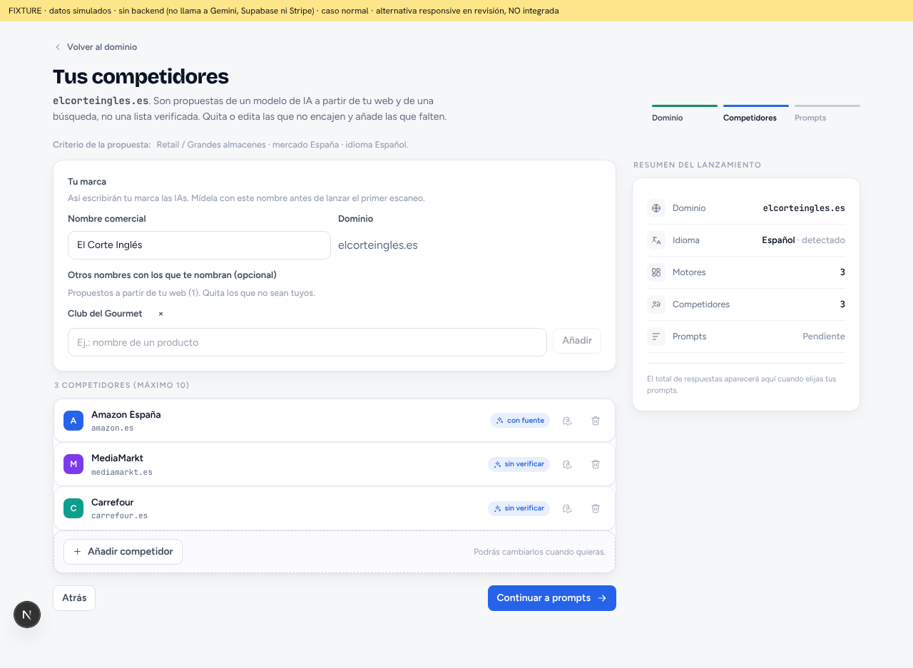

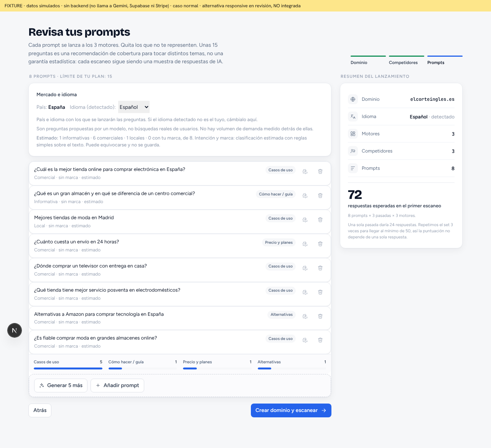

## Texto largo (paso 2)

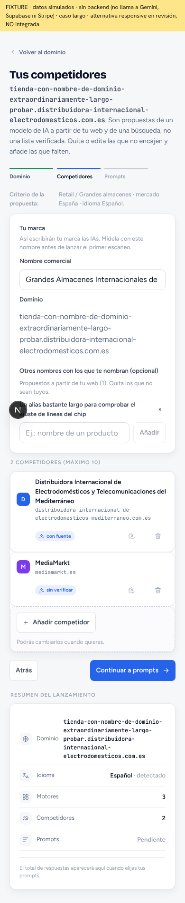

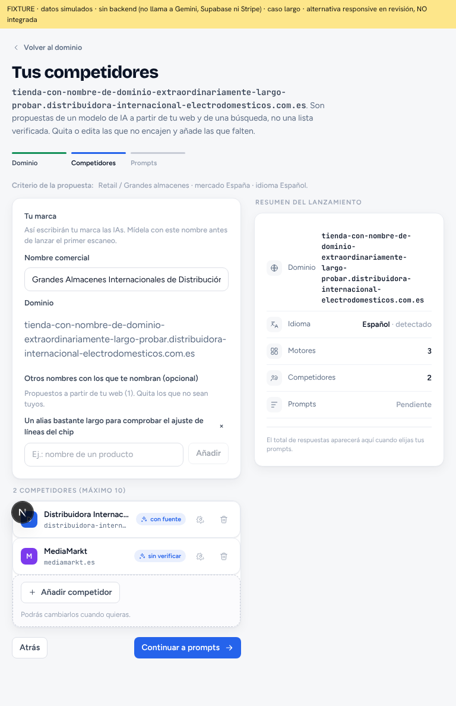
