# Evidencia · alternativa responsive del asistente (LOCAL, sin integrar)

**Esto NO está integrado ni en un PR.** Vive en la rama **local** `claude/onb-responsive-1` (commit `f8e5f1b1`, sin empujar), construida sobre el head del wizard `ae5a776f`. Respuesta al Director de #553 (revisión 6): «el overflow queda corregido pero el campo dominio/país y los textos de prompts/competidores no se pueden revisar bien a 320».

## Qué son estas imágenes

**FIXTURE — datos simulados.** Playwright contra `next dev` local con una página temporal **que no está en el repo** (respuestas fijas en lugar de las server actions; sin Gemini, sin Supabase, sin preview de Vercel).
Cada captura lleva una banda amarilla que lo dice. **Una imagen no es una prueba de interacción**; la interacción medida está más abajo. Los favicons rotos y el distintivo «N» de Next son ruido del fixture.

## Qué cambia (misma información y mismas acciones; solo dónde caen)

| Cambio | Hasta | Antes |
|---|---|---|
| Rejilla de una columna con `minmax(0, 1fr)` | 760 px | `1fr` ensanchaba la columna a ~427 px en cualquier móvil |
| **Nombre del país y chevron visibles** en la barra de dominio | 760 px | Una regla antigua de MOBILE-1 (`globals.css`, ~l. 8472) los **ocultaba a propósito**: solo bandera |
| Barra de dominio en **dos filas** (campo arriba; país y «Continuar» debajo) | 900 px | Una fila; a 768 px el campo de dominio medía **47 px** |
| Filas de competidores y prompts: **chips y acciones debajo del texto** | 560 px | El chip y los botones le quitaban ~120 px al texto |
| **Texto de cada prompt completo** (sin puntos suspensivos) | 560 px | Una línea recortada |
| **Objetivos de 44 px** (botones de pie, filas, campos, selectores); la × de quitar alias y el enlace «con fuente» amplían solo el área pulsable | 760 px | 28–40 px |

**Cambios en el TSX (sin tocar props, textos ni etiquetas accesibles):** el nombre del país, el contenedor del texto del prompt y el selector de idioma dejan de llevar `style` en línea (un `@media` no puede sobrescribirlo) y pasan a clases;
las filas de prompt llevan el modificador `onb2-row--prompt`. Todo el CSS nuevo va acotado a `.onb2-scope`. **Las únicas pantallas que usan estas clases son los tres pasos del asistente** (búsqueda en `app/`, `components/` y `lib/`).

**Semántica que cambia (a revisar):** el país pasa de «solo bandera» a bandera + nombre en ≤ 760 px; la barra de dominio cambia de una a dos filas en ≤ 900 px; entre 561 y 1280 px el texto del prompt sigue en **una línea recortada con el engranaje para desplegarlo** (diseño aprobado), solo es completo en ≤ 560 px.

## Qué se midió (12 combinaciones: 3 pasos × 320 / 360 / 390 / 1280 px)

- **0 elementos fuera del viewport** y `scrollWidth = clientWidth` en las 12.
- **0 textos recortados** (prompts, nombres y dominios de competidor, nombre del país) en 320, 360 y 390.
- Nombre del país visible (44 px de ancho) en los tres anchos móviles y en 1280. Texto de cada prompt a ancho completo: 250 px (320), 290 (360), 320 (390).
- **0 controles por debajo de 44 px en 320, 360 y 390.** Dos elementos miden menos como caja pero tienen área pulsable de 44 px, **comprobada con `elementFromPoint`**: la × de quitar alias (caja 24×24, área 44×44) y el enlace «con fuente» (caja 52×16, área 72×44).
- Tramo 561–768 px: 0 fuera del viewport; el campo de dominio pasa de 47 px a 295–434 px en 761–900.
- Orden de Tab (nombre comercial → × del alias → campo de alias → enlace «con fuente» → editar/quitar de cada competidor; y, en el paso 3, idioma → editar/quitar de cada prompt): coherente con el orden visual.
- 1280 px: sin cambios de diseño respecto a antes (los controles de escritorio siguen por debajo de 44 px, como estaban).

## Qué NO se verificó

- Dispositivo real, iOS Safari, Android, otros navegadores (solo Chromium sobre Linux); lector de pantalla.
- Tab completo hasta los botones de pie en los pasos 2 y 3 (se midieron los primeros 8–9 tabuladores).
- A **768 px** (tableta vertical) el texto del prompt sigue en una línea recortada (diseño original; 4 filas recortadas en la medición).
- Una creación real o un escaneo.
- El comportamiento con textos mucho más largos que los del fixture.

## Capturas

### 320 px

**Paso 1 · dominio**

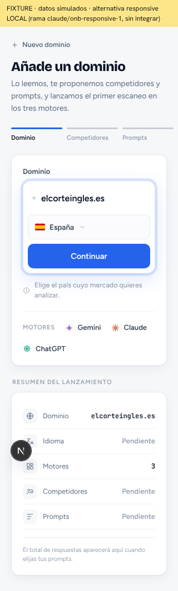

**Paso 2 · competidores e identidad**

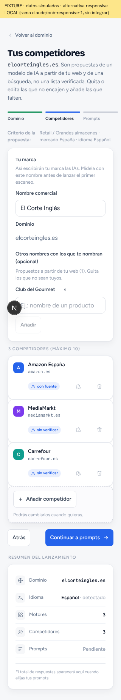

**Paso 3 · prompts**

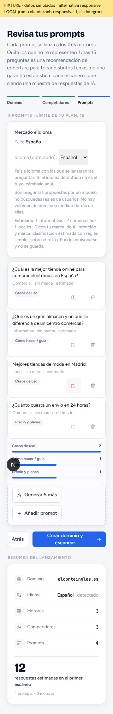

### 360 px

**Paso 1 · dominio**

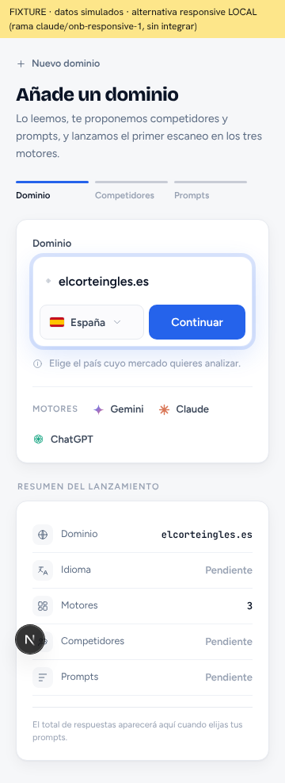

**Paso 2 · competidores e identidad**

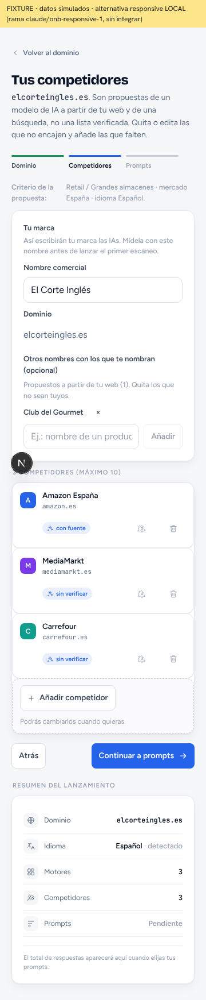

**Paso 3 · prompts**

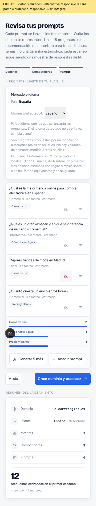

### 390 px

**Paso 1 · dominio**

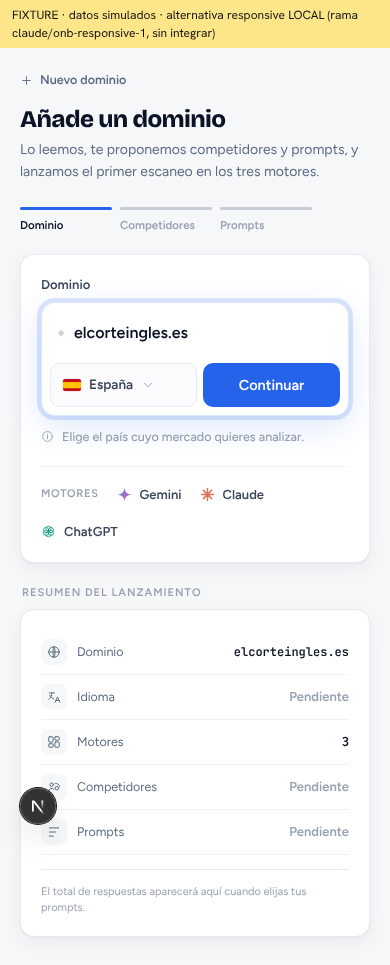

**Paso 2 · competidores e identidad**

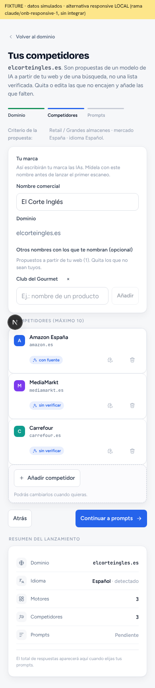

**Paso 3 · prompts**

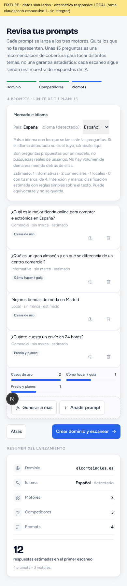

### 1280 px

**Paso 1 · dominio**

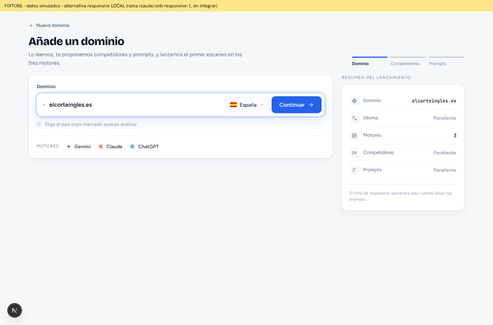

**Paso 2 · competidores e identidad**

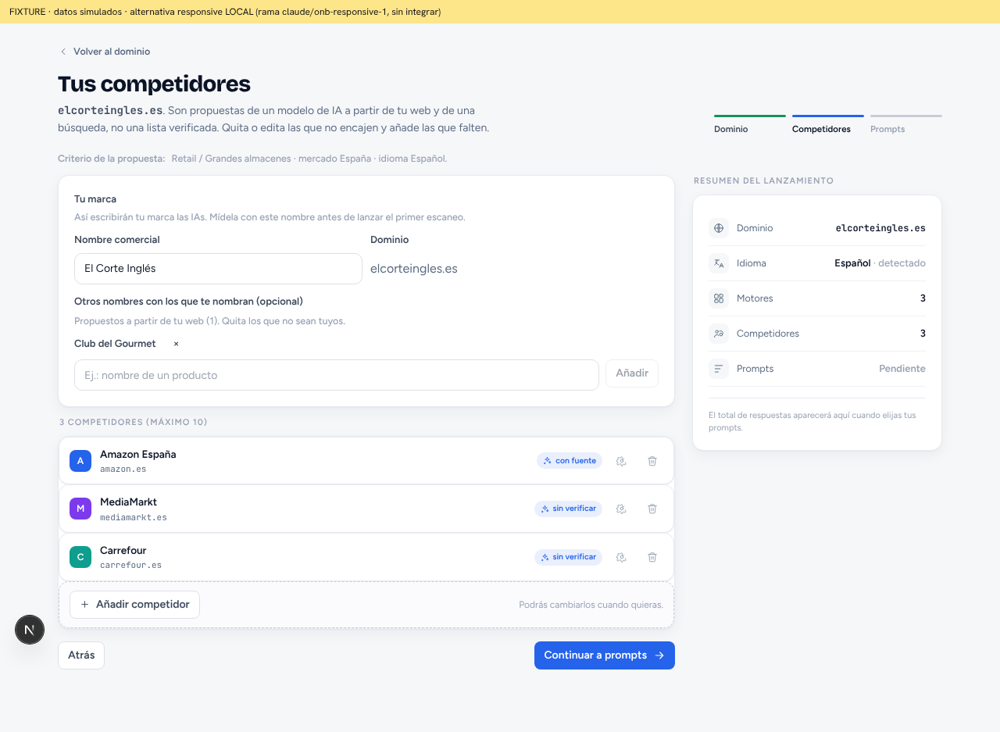

**Paso 3 · prompts**

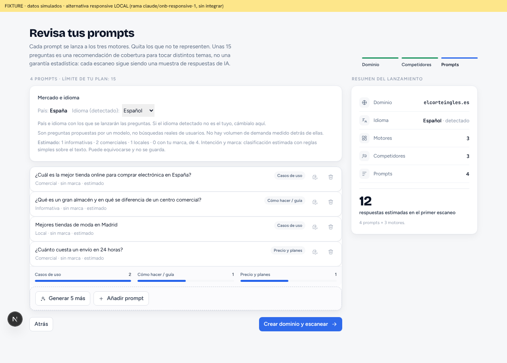

