# Evidencia · ONBOARDING-UX-1 (parche local en la rama de #553) — FIXTURE

**Datos simulados.** Playwright (Chromium/Linux) contra `next dev` con rutas temporales **que no están en el repo**, con respuestas fijas: sin Gemini, Supabase ni Stripe, sin escaneos. **No es el preview real ni un dispositivo real**, y una imagen no es una prueba de interacción: la interacción está medida abajo.
Estas capturas **incluyen por primera vez el estado «identidad pendiente» (`pending = true`) y el estado de portada ilegible** (los fixtures anteriores solo tenían `pending = false`, es decir, no cubrían lo que ve un usuario real). Se concentran en lo que cambió; el resto de combinaciones no se recapturan. Dejan superadas, para estas pantallas, las capturas de `onboarding-proposals-1` y `onboarding-integrated`.

## Qué cambió (respuesta a la prueba real de Denis, Director 6070300363)

| Pantalla | Antes | Ahora |
|---|---|---|
| Marca | 5 bloques de texto; «El nombre es correcto» era un botón dentro de una frase | «Confirma tu marca» → «Nombre comercial» → «Revisa cómo se escribe tu marca» (solo si pendiente) → botón propio **«Confirmar nombre»** (44 px) → dominio en línea secundaria → alias en desplegable (abierto si hay propuestas) |
| Competidores | Subtítulo de ~170 car. + línea de criterio | «Propuestas de IA. Revisa o edita antes de continuar.»; método, criterio y significado de «con fuente / sin verificar» en **«Cómo se han propuesto»**; los chips por fila no cambian |
| Prompts | Idioma como `<select>` nativo de 32 px; tres notas + una etiqueta en cada fila | País e idioma en cajas del **mismo sistema** (44 px, etiqueta, foco); aviso corto «Preguntas propuestas por IA, sin volumen de búsqueda medido.»; recuento estimado, notas y cobertura en **«Cómo se han elegido»**; aviso «ninguna local» **a la vista**; etiqueta por fila solo si es local o con tu marca |
| Texto del prompt | 1 línea con puntos suspensivos (561–900 px) | **Hasta 3 líneas** y, **solo si no cabe, un botón visible «Ver completo»** que abre el editor; ≤ 560 px completo |
| Editor de prompt | 76 px fijos (cortaba un prompt largo) | **Crece con el texto** (tope 320 px) |

## Medidas (fixture, 390 / 768 / 1280)

- Sin desbordes de página en los 4 estados × 3 anchos medidos.
- **«Confirmar nombre»**: `<button>` hermano del campo (no dentro de un `
`), 141×44 px, azul, aro de foco de 2 px; **Enter lo confirma y retira aviso y botón**.
- **Idioma**: la caja recibe el foco (aro visible) y **ArrowDown cambia** a «Inglés» con el teclado; «Cómo se han elegido» **abre con Enter** en los tres anchos.
- **Tab** desde el inicio hasta «Continuar a prompts» (15 paradas) y «Crear dominio y escanear» (12): alcanzado en los tres anchos; el orden es el visual (nombre → alias → «Cómo se han propuesto» → filas → pie).
- **Error de portada → descripción → paso 2**: el campo de descripción aparece, con descripción llega al paso 2 y la marca sigue pendiente de confirmar.
- **Texto largo**: «Ver completo» aparece a **390 y 768 px** y abre el editor con el **texto íntegro (218 caracteres) sin recorte** (320 y 188 px de ancho); a **1280 px el prompt de 218 caracteres cabe en las 3 líneas y no hace falta botón**.
- 0 controles bajo 44 px en 390 salvo la × de quitar alias (24×24, con área pulsable ampliada a 44×44 desde el parche anterior).

## Límites (no se oculta nada)

- Fixture, Chromium sobre Linux: **sin dispositivo real, otros navegadores, lector de pantalla ni preview real con backend**.
- «Ver completo» se decide **midiendo** el texto en el navegador; en el render del servidor no aparece (no hay medida), así que el primer pintado no lo muestra hasta hidratar.
- El aviso de «identidad pendiente» del paso 3 (existente, con enlace «revisarlo ahora») **no se ha tocado** y suma una línea larga con marcas de nombre largo; es candidato a un recorte posterior si el Director lo pide.
- Todo lo de la lectura de la portada (causa del fallo, «Auditoría web no disponible») **no está implementado**: ver `docs/specs/web-audit/fetch-cause-and-audit-unavailable-proposal.md`.

## Marca pendiente (paso 2)

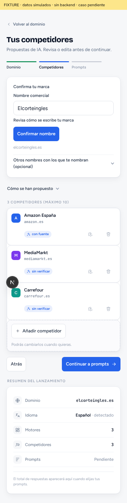

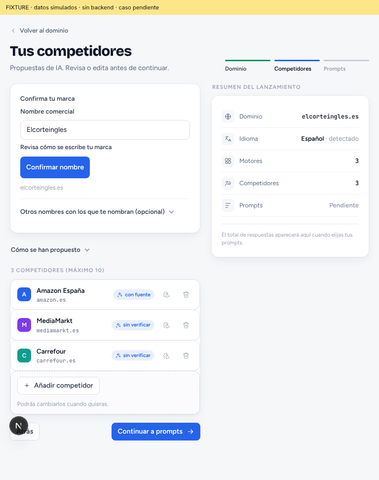

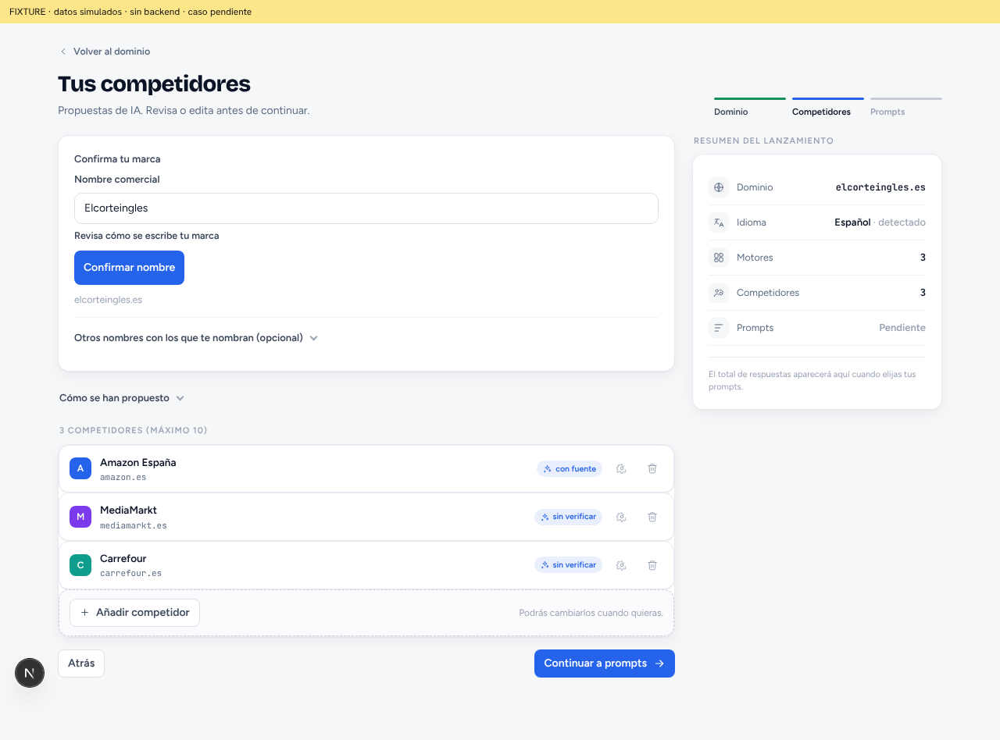

## Portada ilegible (paso 1)

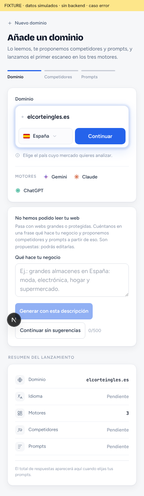

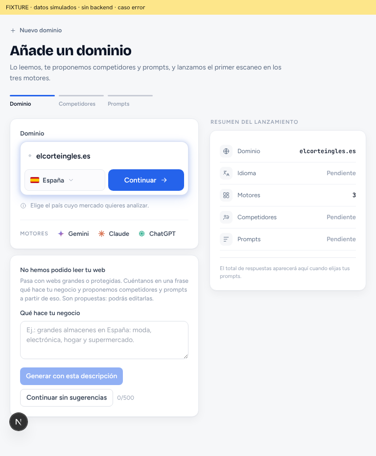

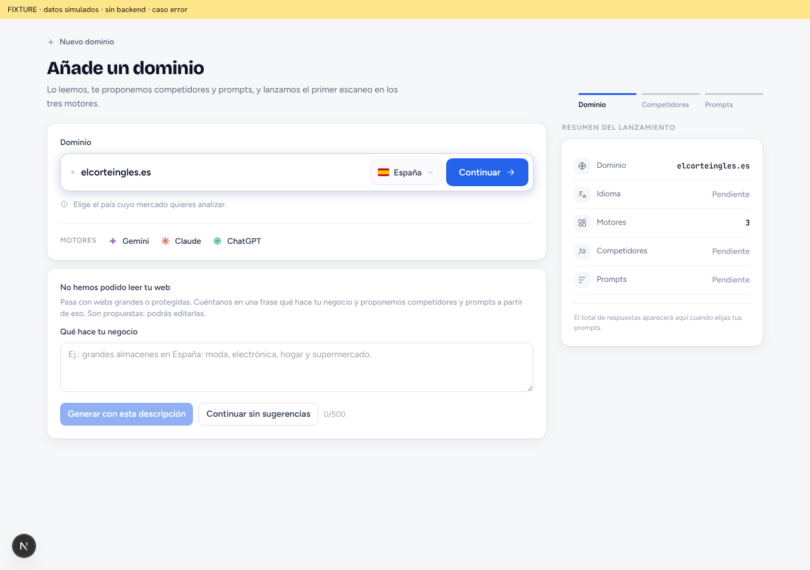

## Prompts: país, idioma y avisos (paso 3)

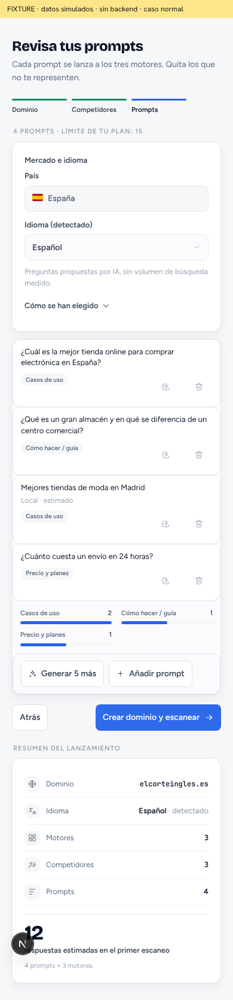

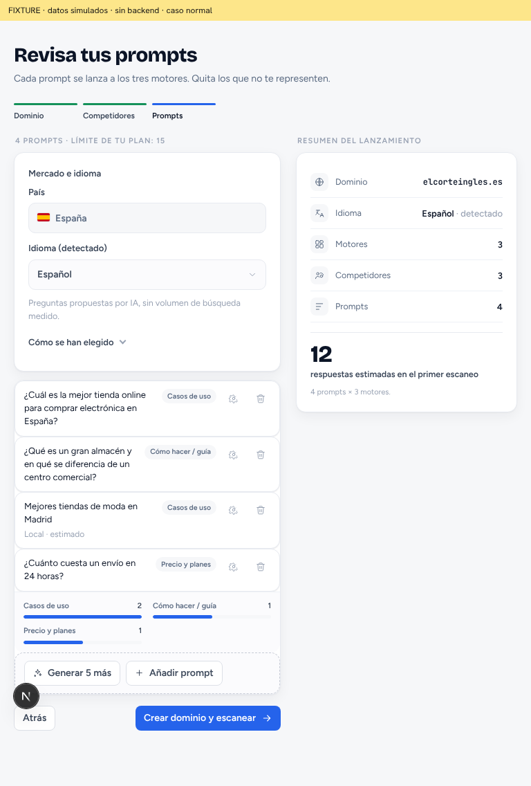

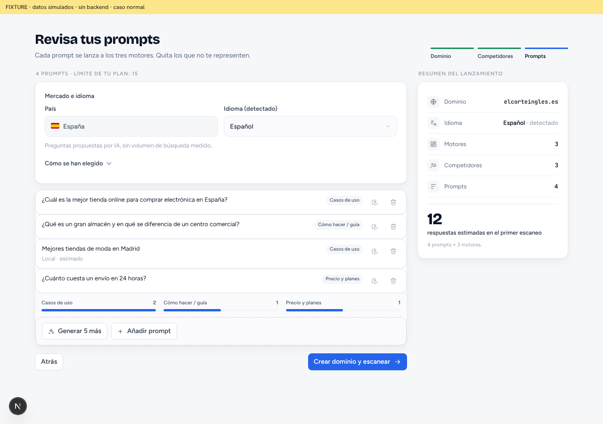

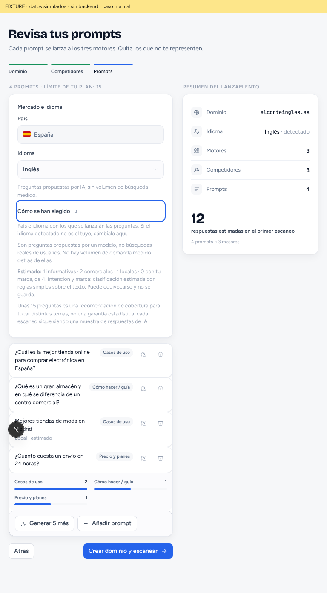

## Texto largo

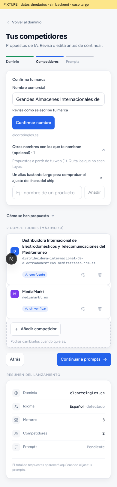

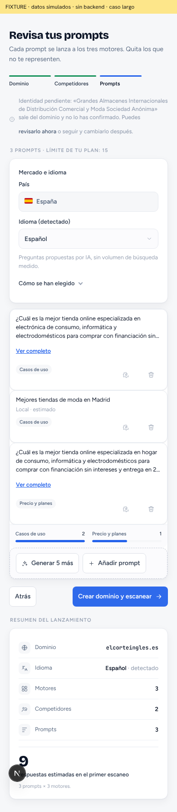

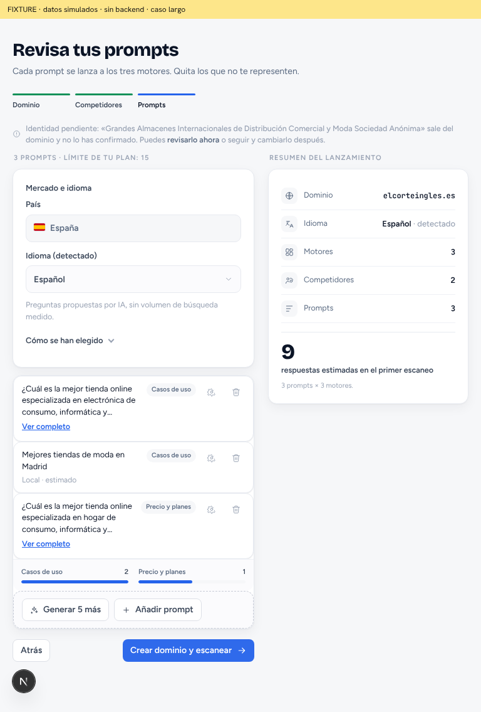

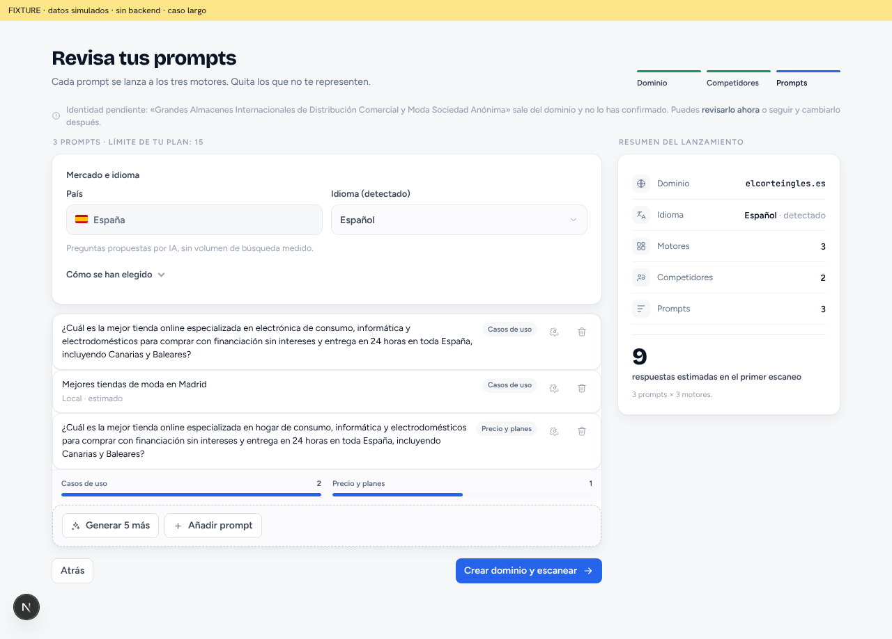

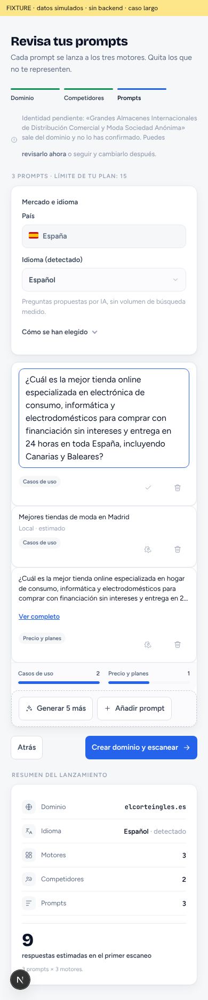

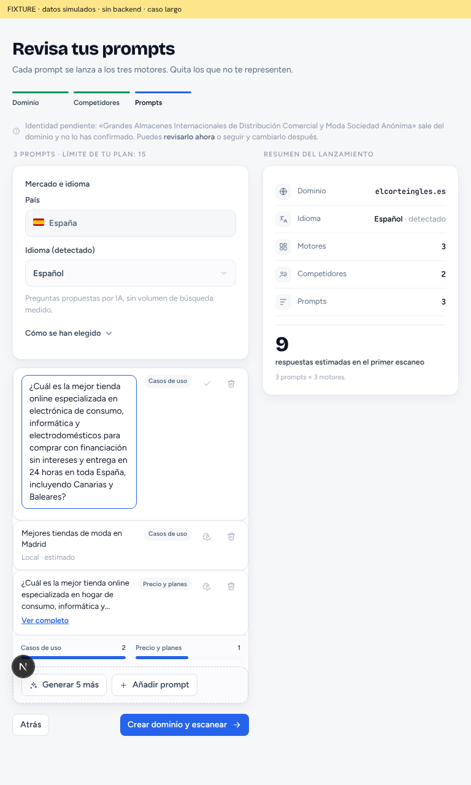
