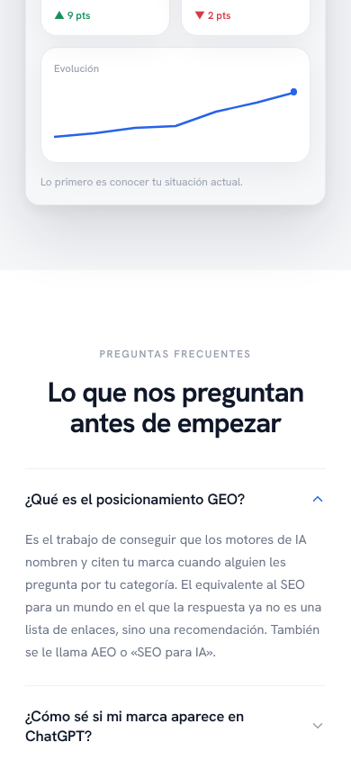
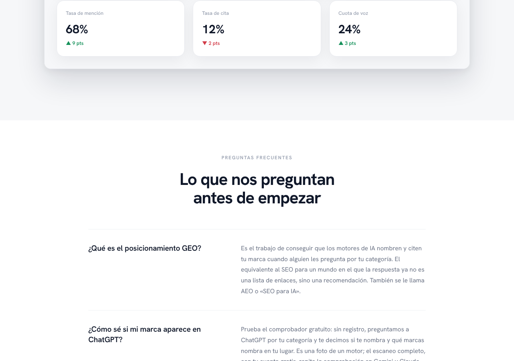
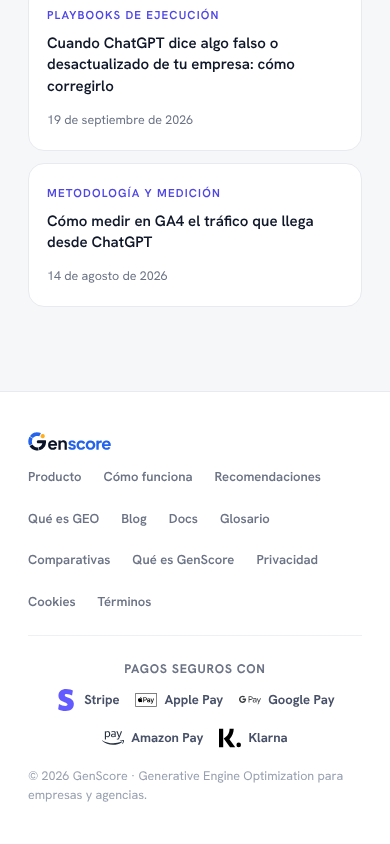
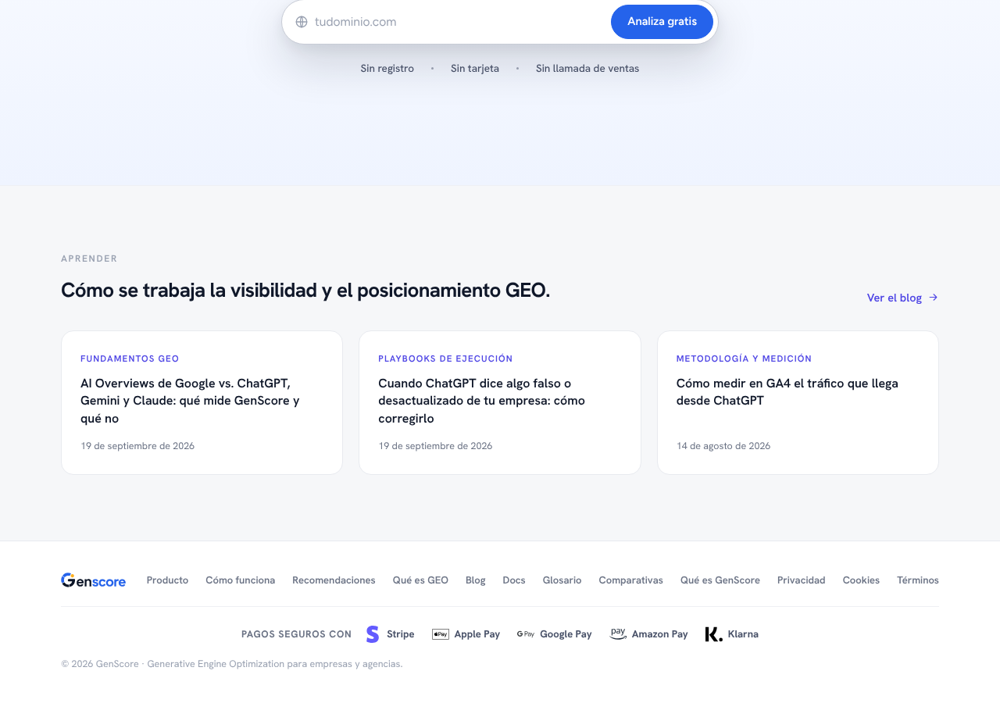

# Evidencia del fix mínimo `fix/remove-invented-testimonial` (código de `0e65373`)

**RENDER LOCAL del build de esta rama** (`next build` + `next start` en un worktree aparte, `main` + este fix, **sin** contrato de 99 € ni SQL), con Supabase
ficticio inalcanzable, sin sesión, sin datos reales y las webfonts del propio build. **No es el despliegue de Vercel, no se lanzó ningún deploy ni piloto
para obtenerlo, y una imagen no prueba interacción.** Lo retirado del código **no es prueba de que esté retirado en producción**: eso depende del merge y
el despliegue del dueño.

## Qué se midió (`dom-report.json`, `cap.cjs`)
- Orden de secciones de la portada en 390 y 1280: `lp-rules → lp-how → lp-prod → lp-faq-sec → lp-close → lp-blog`. **No hay ninguna sección entre «producto» y
  «preguntas frecuentes».**
- Hueco entre el final de `lp-prod` y el inicio de `lp-faq-sec`: **0 px** en las dos anchuras. Fondo de `lp-prod` `rgb(246,247,249)`, el de la FAQ transparente
  sobre el blanco de la página: el cambio de tono es un canto recto entre dos secciones, como entre cualquier otro par de secciones de la página.
- Texto o clases del testimonio en el DOM (`Nerea`, `Nordika`, `128 %`, `lp-testi`): **ninguno**. Desbordamiento horizontal del documento: **0 px**.

## Imágenes

## Qué NO cubre
- No compara con la portada de `main` antes del cambio píxel a píxel (no hay captura «antes» de este entorno); la regresión se acota por la medición del DOM de arriba.
- Solo Chromium sobre Linux; no dispositivo real; no el despliegue de Vercel; no las demás páginas públicas (el CSS retirado solo contenía clases `.lp-testi*`, sin
  uso fuera de esa sección: lo comprueba `tests/no-invented-customer-claims.test.ts`).
